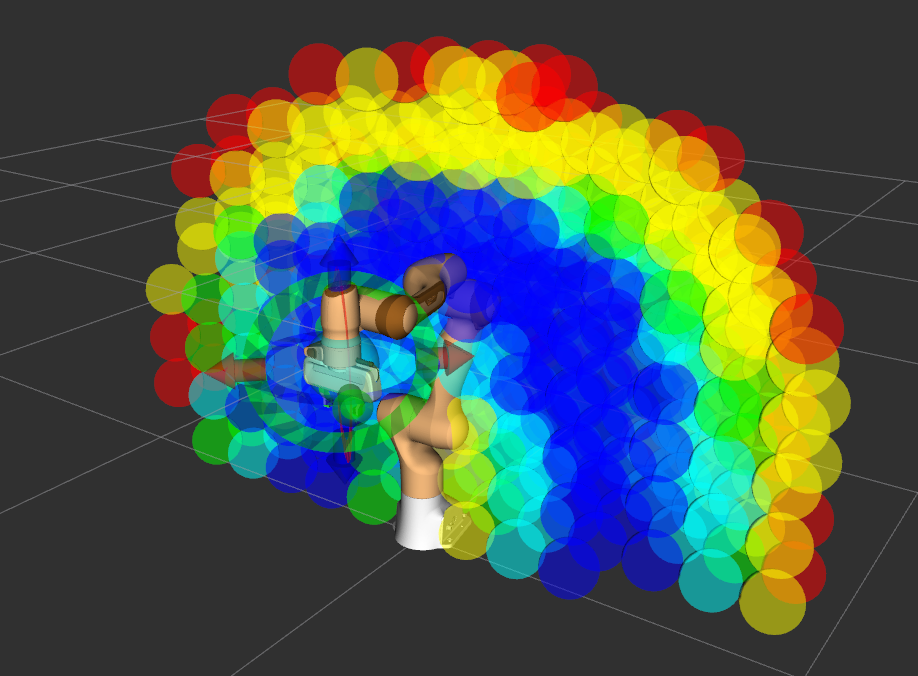
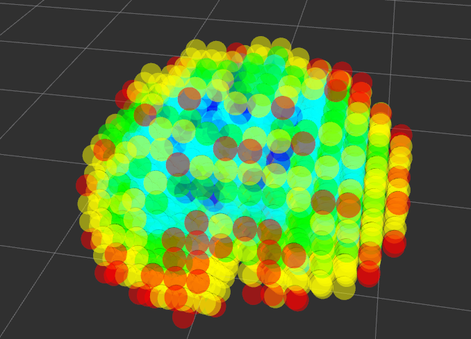

# reuleaux_moveit
---

## Overview
This version of Reauleaux creates reachability maps using the [MoveIt!](https://moveit.ros.org/) interface.
Allowing Reuleaux to create a map of redundant manipulators with self collision checking.


### License
`TBD`
This source code is released under the ... license.

---

## Installation
1. Follow the [installation instructions](https://ros-planning.github.io/moveit_tutorials/doc/getting_started/getting_started.html#create-a-catkin-workspace-and-download-moveit-source) for MoveIt! for ROS Noetic.

2. You will need an updated fork of the original [Reuleaux package](http://wiki.ros.org/reuleaux) to visualise maps, however you won't need to install OpenRAVE to build this.

Working in you catkin_ws/src directory...
```bash
git clone --branch noetic-devel https://github.com/MShields1986/reuleaux.git
```

3. Clone this package, again working in you catkin_ws/src directory...
```bash
git clone --branch noetic-devel https://github.com/MShields1986/reuleaux_moveit.git
```

4. Update and install any dependencies...
```bash
sudo apt update
rosdep update
rosdep install -r -y --from-paths . --ignore-src
```

5. Build the project...
```bash
cd ..
catkin build --cmake-args -DCMAKE_BUILD_TYPE=Release
```

---

## Usage
A launch file is included that can be used with [the Panda arm demo](https://ros-planning.github.io/moveit_tutorials/doc/quickstart_in_rviz/quickstart_in_rviz_tutorial.html) that is bundled with MoveIt!

### Create a Reachability Map
Check the settings in [the launch file](https://github.com/MShields1986/reuleaux_moveit/blob/noetic-devel/map_generation/launch/panda_demo.launch) and then run...
```bash
roslaunch map_generation panda_demo.launch
```

Note that MoveIt! will throw a `Found empty JointState message` error for every pose solution (which is a lot), this is a [known issue](https://github.com/ros-planning/moveit/issues/659) and doesn't effect the generation of reachability maps.

### Visualise an Existing Reachability Map
To load an existing reachability map...
```bash
roslaunch map_generation panda_demo.launch create_map:=false
```

Note that the map to be loaded is currently not parameterised, so needs to be changed in [the launch file](https://github.com/MShields1986/reuleaux_moveit/blob/noetic-devel/map_generation/launch/panda_demo.launch) itself. The default is to load `map_generation/maps/panda_arm_0.15_reachability.h5`



### Inverse Reachability Maps
Inverse reachability maps can be created using [Reuleaux](http://wiki.ros.org/reuleaux#Inverse_Reachability_Map).
```bash
# The command takes the form of...
# rosrun map_creator create_inverse_reachability_map path_to/input_reachability_map.h5 path_to/output_inverse_map.h5

# For example
roscd map_generation/maps/

rosrun map_creator create_inverse_reachability_map panda_arm_0.15_reachability.h5 ../../../reuleaux_moveit/map_generation/maps/panda_arm_0.15_inverse_reachability.h5
```

### Visualise an Existing Inverse Reachability Map
To load an existing inverse reachability map...
```bash
roslaunch map_generation panda_demo.launch load_manipulator:=false create_map:=false
```

Note that the map to be loaded is currently not parameterised, so needs to be changed in [the launch file](https://github.com/MShields1986/reuleaux_moveit/blob/noetic-devel/map_generation/launch/panda_demo.launch) itself. The default is to load `map_generation/maps/panda_arm_0.15_inverse_reachability.h5`



### Use an Inverse Reachability Map for Finding Base Positions
This is done via the Reuleaux base_placement_plugin for RViz, which can be launched using...
```bash
roslaunch map_generation panda_demo.launch create_map:=false base_placement:=true
```

Then follow the [Reuleaux Wiki](http://wiki.ros.org/reuleaux) steps for loading the inverse reachability map etc.


---

## Bugs and Feature Requests
Please report bugs and request features using the [issue tracker](https://github.com/jontromanab/reuleaux_moveit/issues).
